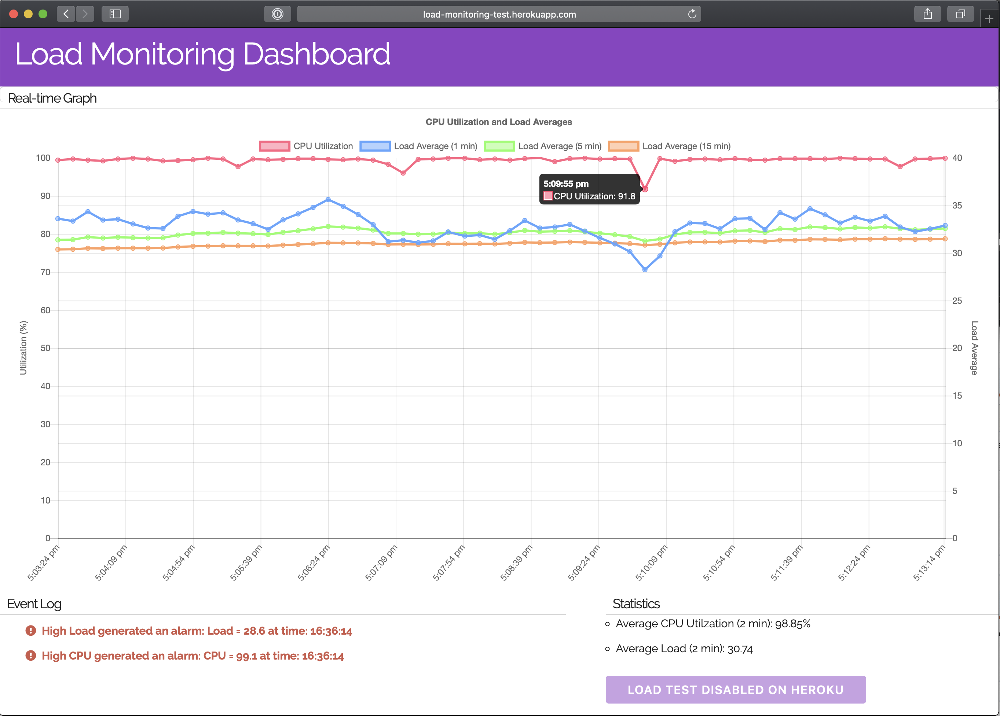

# Load Monitoring Web Application

A simple web application to track average system load and CPU Utilization on your machine.

## Getting Started


### Prerequisites
It is __highly__ reccomended to use a virtual environment and/or package manager such as virtualenv or conda to avoid polluting the global Python namespace. Additionally, this application requires Python 3, so you may have to modify the commands below to `pip3` or `python3` depending on your aliases and local Python setup.

For the server app, all of the required modules are included in *requirements.txt*, so you can simply run: 

```bash
pip install -r requirements.txt
```

The client-side dependencies are all explicitly declared in the template (for now) so there is no need to download anything.


### Installing

To get up and running, first clone the repository to a location on your local computer: 

```bash
git clone https://github.com/ysuhaas/load-monitoring-web-app.git
```

Then, from the server directory, run `server_monitor.py` with a Python 3 interpreter:

```bash
cd server/
python3 server_monitor.py
```

### Running

Now, in a web browser, simply navigate to [http://localhost:5000/](http://localhost:5000/). You should be able to see data streaming. Note that you can enable/disable data series on the graph by clicking on the label on the legend above the graph.

Screenshot of app running on Heroku:




## Implementation


### Details

To query the system load and average CPU utilization of the system, we use the python modules `os` (included) and `psutil` (installed using pip). A basic webapp is created using Flask, and served on a local webserver. Socket.IO was used then to push messages to the client, using the Flask-SocketIO library. The alering thersholds are set at 75% for the CPU utilization, and the number of CPU cores for system load.

To display the data, Chart.js is used to graph the last 20 minutes of data. There is a test for the alert functionality, which simply spawns a number of threads to perform an operation in a while loop to load the CPU.


### List of Frameworks/Libraries Used
Client-side:   

* [Chart.js](https://www.chartjs.org/) - Open source HTML5 graphs
* [Moment.js](https://momentjs.com/) - Date/time parsing library in JavaScript
* [Socket.IO](https://socket.io/) - Realtime, bi-directional communication between web clients and servers. 

Server-side:   

* [Flask](http://flask.pocoo.org/) - A lightweight web application framework in Python
* [Flask-SocketIO](https://flask-socketio.readthedocs.io/en/latest/) - Support for WebSockets in Flask applications 
* [Eventlet](http://eventlet.net/) - A concurrent networking library for Python

